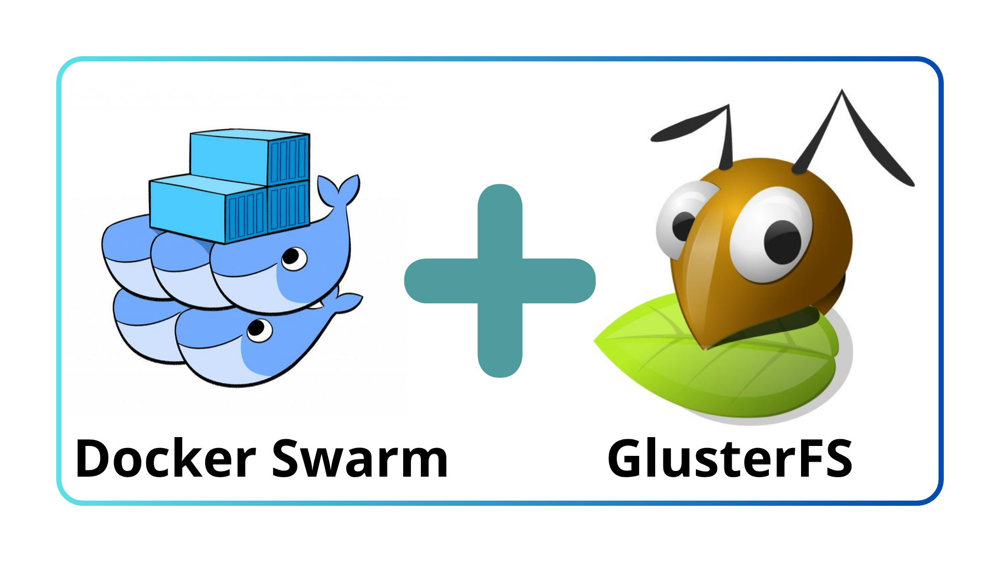

# Procédures d'installation 🐳Docker Swarm avec réplication 🐜GlusterFS et 🌐VIP via `keepalived`

<p align="center"></p>

Tout d'abord, on va commencer par l'installation de GlusterFS car c'est le logiciel le plus complexe à mettre en place. Les pré-requis sont adaptés à la maniere dont, j'ai fait l'installation.

## Introduction

Qu'est-ce que GlusterFS, Docker Swarm & keepalived?

## ✔️0. Pré-requis

### Environnement:
- 3 machines Debian 13 (à jour)
- Chaque machine à une IP fixe
- Prévoir une 4e adresse IP fixe pour la Virtual IP (VIP)
- Chaque machine possède 2 disques (1 pour le système et l'autre pour GlusterFS)

### Nom des machines :
- `swarm01`
- `swarm02`
- `swarm03`

### Machine:
- 4 vCPU
- 4 Go RAM
- 1 disque 16 Go (minimum)
- 1 disque 100 Go (Taille au choix - Stockage volumes Docker Swarm)

## 🐜1. Installation GlusterFS

*A partir de ce moment, je recommande de taper toutes les commandes avec  `root` pour gagner du temps.*

Sur les 3 noeuds, faites :
```bash
apt update && apt install glusterfs-server -y
```

On va maintenant passé au paramétrage des noms DNS. Il est recommandé de passé par les noms DNS pour GlusterFS.

Pour les tests, on utilisera les IPs suivantes, remplacez par les votres évidemment :
- swarm01 : 192.168.1.1
- swarm02 : 192.168.1.2
- swarm03 : 192.168.1.3

swarm01 :
```bash
cat >> /etc/hosts << EOF
192.168.1.2 swarm02
192.168.1.3 swarm03
EOF
```

swarm02 :
```bash
cat >> /etc/hosts << EOF
192.168.1.1 swarm01
192.168.1.3 swarm03
EOF
```

swarm03 :
```bash
cat >> /etc/hosts << EOF
192.168.1.1 swarm01
192.168.1.2 swarm02
EOF
```

On va ensuite passer au paramétrage de `sdb`. Dans mon cas particuler, je travaille avec `ext4`. Adaptez la commande si besoin :

*(Je n'ai pas fait de partitionnage, j'installe tout directement sur sdb)*
```bash
mkfs.ext4 -I 512 /dev/sdb
mkdir -p /data/brick1
cat >> /etc/fstab << EOF
# Databrick GlusterFS
/dev/sdb /data/brick1 ext4 defaults,acl,user_xattr 0 2
EOF
systemctl daemon-reload
mount -a
```

Parfois il arrive que le fstab ce lance plus que GlusterFS ce qui bloque la machine au lancement. Pour éviter ce probleme, on peut rajouter nofail dans le fstab pour forcer le démarrage de la machine sans que le databrick ce monte.

Avantages : 
- La machine ne se bloque pas au démarrage
- La databrick se lancera après, une fois qu'elle sera prete
- Evite les downtimes de maniere aléatoire

Désavantages :
- Si vous avez un vrai probleme réseau, la machine va quand meme ce lancer au lieu de se bloquer au démarrage

Dans mon cas, j'ai préféré ajouter le nofail car pendant les phases de test, j'ai eu plusieurs fois des blocages.

Pour cela faites cette commande sur les 3 serveurs :

```bash 
sed -i 's|^/dev/sdb /data/brick1 ext4 defaults,acl,user_xattr 0 2$|/dev/sdb /data/brick1 ext4 defaults,acl,user_xattr,nofail 0 2|' /etc/fstab
```


On active GlusterFS et on vérifie que tout est vert :
```bash
systemctl enable --now glusterd.service
systemctl status glusterd
```


Depuis le swarm01, on va peer les autres serveurs GlusterFS. Sur swarm01 faites :
```bash
gluster peer probe swarm02
gluster peer probe swarm03
```

Pour vérifier que tout est bon, sur les serveurs faites :
```bash
gluster peer status
```

## 1.1. Mise en place du Databrick


Sur tout les serveurs :
```bash
mkdir -p /data/brick1/gv0
```

Sur 1 seul serveur au choix :
```bash
gluster volume create gv0 replica 3 swarm01:/data/brick1/gv0 swarm02:/data/brick1/gv0 swarm03:/data/brick1/gv0
```

Vous devriez avoir un output comme ça :
> `volume create: gv0: success: please start the volume to access data`

Sur 1 seul serveur, on va activer la databrick gv0 :
```bash
gluster volume start gv0
```

En cas de succès :
> `volume start: gv0: success`

On vérifie que tout gv0 est bien activé sur tout les serveurs :
```bash
gluster volume info
```

Vous devriez avoir ça sur tout les serveurs :

```groovy
Volume Name: gv0
Type: Replicate
Volume ID: f25cc3d8-631f-41bd-96e1-3e22a4c6f71f
Status: Started
Snapshot Count: 0
Number of Bricks: 1 x 3 = 3
Transport-type: tcp
Bricks:
Brick1: swarm01:/data/brick1/gv0
Brick2: swarm02:/data/brick1/gv0
Brick3: swarm03:/data/brick1/gv0
Options Reconfigured:
transport.address-family: inet
```

## 1.2. Montage GlusterFS

Maintenant que le databrick est pret, on peut maintenant commencer à mettre en place le premier montage de réplication. Toutes les données qui se trouve dans ce montage, seront répliqués entre les noeuds.

Sur les 3 serveurs, créer un point de montage :

```bash
mkdir -p /mnt/docker
```

`swarm01` :
```bash
mount -t glusterfs swarm01:/gv0 /mnt/docker -o backup-volfile-servers=swarm02:swarm03
```

`swarm02` :
```bash
mount -t glusterfs swarm02:/gv0 /mnt/docker -o backup-volfile-servers=swarm01:swarm03
```

`swarm03` :
```bash
mount -t glusterfs swarm03:/gv0 /mnt/docker -o backup-volfile-servers=swarm01:swarm02
```

Maintenant faites un test en créant 1 fichier dans `/mnt/docker/` depuis n'importe quel serveur et vérifier si il c'est répliquer sur les autres.

Si sa marche, on peut passer à la prochaine étape qui est le montage automatique de `/mnt/docker`

## 1.3. Montage automatique de la réplication

Normalement, il faudrait utiliser /etc/fstab pour monter automatiquement les volumes GlusterFS, or j'ai remarqué que GlusterFS devient opérationnel après le montage `/etc/fstab`.

Ce qui est problématique, car cela voudrait dire que je n'ai plus de réplication jusqu'a qu'un utilisateur se connecte mannuellement et fasse un `mount -a`.

Pour éviter cela, j'ai décidé créer un script qui va refaire un mount toutes les 5 secondes jusqu'a qu'il marche.

swarm01 :
```bash
touch /usr/local/sbin/docker_mount.sh
chmod 744 /usr/local/sbin/docker_mount.sh
cat > /usr/local/sbin/docker_mount.sh << EOF
#!/bin/bash
# Script lancement mount GlusterFS

sleep 2

while true
do
    mount -t glusterfs swarm01:/gv0 /mnt/docker -o backup-volfile-servers=swarm02:swarm03
    case $? in
        0) break;;
        *) sleep 5;;
    esac
done
EOF
echo "@reboot root /usr/local/sbin/docker_mount.sh" > /etc/cron.d/docker_mount
```

swarm02 :
```bash
touch /usr/local/sbin/docker_mount.sh
chmod 744 /usr/local/sbin/docker_mount.sh
cat > /usr/local/sbin/docker_mount.sh << EOF
#!/bin/bash
# Script lancement mount GlusterFS

sleep 2

while true
do
    mount -t glusterfs swarm02:/gv0 /mnt/docker -o backup-volfile-servers=swarm01:swarm03
    case $? in
        0) break;;
        *) sleep 5;;
    esac
done
EOF
echo "@reboot root /usr/local/sbin/docker_mount.sh" > /etc/cron.d/docker_mount
```

swarm03 :
```bash
touch /usr/local/sbin/docker_mount.sh
chmod 744 /usr/local/sbin/docker_mount.sh
cat > /usr/local/sbin/docker_mount.sh << EOF
#!/bin/bash
# Script lancement mount GlusterFS

sleep 2

while true
do
    mount -t glusterfs swarm03:/gv0 /mnt/docker -o backup-volfile-servers=swarm01:swarm02
    case $? in
        0) break;;
        *) sleep 5;;
    esac
done
EOF
echo "@reboot root /usr/local/sbin/docker_mount.sh" > /etc/cron.d/docker_mount
```

Maintenant, a chaque fois que les serveurs vont redémarrer. Le montage `/mnt/docker` va toujours se remonter, peu importe le délai.

Pour être sûr que tout marche je propose de faire ces tests :
- Créer un fichier dans le `/mnt/docker` pour voir si la réplication marche entre les serveurs, par exemple `test.txt`
- Rédémarrer un par un les serveurs pour voir si le montage remonte automatiquement et vérifier si `test.txt` apparait bien a chaque fois. Il faut parfois attendre quelques secondes pour le montage de `/mnt/docker`.
- Redémarrer les 3 serveurs en même temps et vérifier que chaque serveur a bien remonté le volume avec la réplication.

Si les tests marche alors on a terminée la partie GlusterFS, on va pouvoir basculer sur **Docker Swarm**.

## 🐳2. Installation Docker Swarm

Pour l'installation de Docker Swarm, on va passer par la documentation officielle (https://docs.docker.com/engine/install/debian/) :


Sur les 3 serveurs :

```bash
# Add Docker's official GPG key:
apt update
apt install ca-certificates curl
install -m 0755 -d /etc/apt/keyrings
curl -fsSL https://download.docker.com/linux/debian/gpg -o /etc/apt/keyrings/docker.asc
chmod a+r /etc/apt/keyrings/docker.asc

# Add the repository to Apt sources:
tee /etc/apt/sources.list.d/docker.sources <<EOF
Types: deb
URIs: https://download.docker.com/linux/debian
Suites: $(. /etc/os-release && echo "$VERSION_CODENAME")
Components: stable
Architectures: $(dpkg --print-architecture)
Signed-By: /etc/apt/keyrings/docker.asc
EOF

apt update && apt install docker-ce docker-ce-cli containerd.io docker-buildx-plugin docker-compose-plugin
```

```bash
```


```bash
```